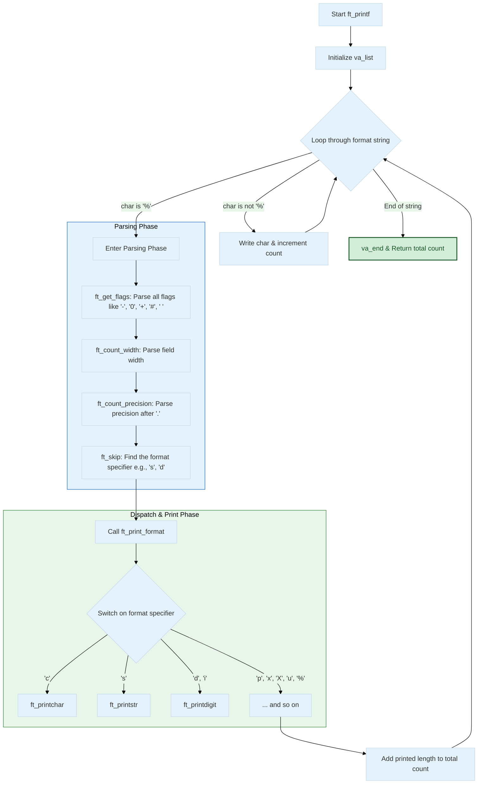
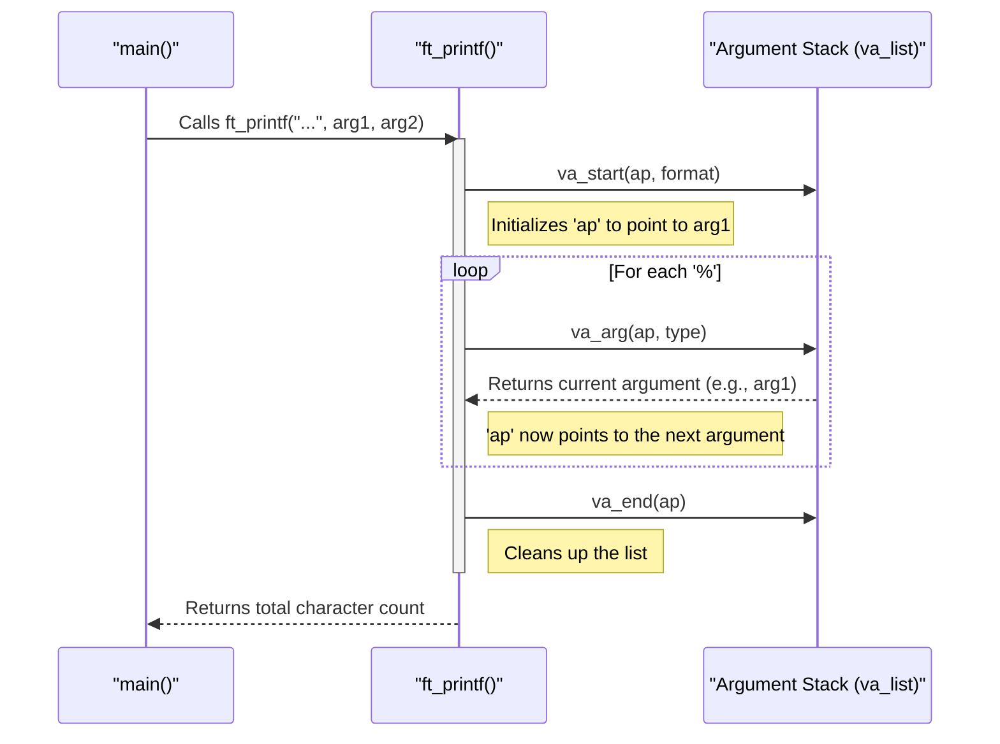

# 🖨️ ft_printf | 42 School Project

### Recreating the magic of `printf`, one format specifier at a time.


> *"The art of formatting output: A deep dive into variadic functions and flag parsing."*

---

## 🎯 Project Overview

`ft_printf` is a fundamental project at 42 School that requires us to re-create the functionality of the standard C library's `printf` function. This project is a major step in learning how to handle a variable number of arguments (variadic functions) and how to parse complex formatting flags to produce precisely formatted output.

My implementation successfully handles a variety of format specifiers and all the standard bonus flags.

---

## 🚀 Getting Started

#### 1. Clone the repository:

```bash
git clone https://github.com/MEHDIJAD/42cursus-ft_printf.git
```

#### 2. Navigate to the project directory:

```bash
cd 42Cursus-ft_printf
```
#### 3. Compile the library:

```bash
make
```

## ✨ Supported Conversions & Flags

This project handles the following conversions and formatting flags:

### Supported Conversions
| Specifier | Output Type |
| :---: | :--- |
| **`%c`** | A single character. |
| **`%s`** | A string of characters. |
| **`%p`** | A `void *` pointer address in hexadecimal format. |
| **`%d`** | A signed decimal integer. |
| **`%i`** | A signed integer in base 10. |
| **`%u`** | An unsigned decimal integer. |
| **`%x`** | An unsigned integer in lowercase hexadecimal format. |
| **`%X`** | An unsigned integer in uppercase hexadecimal format. |
| **`%%`** | A literal percent sign. |

### Bonus: Supported Flags
| Flag | Description |
| :---: | :--- |
| **`-`** | Left-justifies the output within the specified width. |
| **`+`** | Forces the display of a sign (`+` or `-`) for signed numbers. |
| **` ` (space)** | If no sign is written, a space is inserted before the value. |
| **`0`** | Pads the output with leading zeros instead of spaces. Ignored if `-` is present. |
| **`#`** | Prepends `0x` or `0X` for `%x` and `%X` specifiers. |
| **`.` (precision)**| Specifies the minimum number of digits to be written. For strings, it's the maximum number of characters. |
| **`(number)` (width)** | Specifies a minimum field width for the output. |

---

## 🪾 Project Structure
```bash
.
├── Makefile
├── ft_printf.c
├── ft_printf.h
└── print_utils
    ├── ft_print_percentage.c
    ├── ft_printaddress.c
    ├── ft_printchar.c
    ├── ft_printdigit.c
    ├── ft_printhex.c
    ├── ft_printstr.c
    ├── ft_printunsigned.c
    ├── ft_tools.c
    └── ft_utils.c

2 directories, 12 files
```
## 🤖 Code Flow & Logic

The core of `ft_printf` is a loop that iterates through the format string. When it encounters a `%`, it enters a parsing and dispatching phase.



## 📋 Usage Examples

**`main.c`**
```c
#include "ft_printf.h"

int main(void)
{
    char    *s = "Hello, World!";
    int     num = -42;
    void    *ptr = s;

    ft_printf("--- Testing ft_printf ---\n");
    ft_printf("String: [%s]\n", s);
    ft_printf("Number: [%d]\n", num);
    ft_printf("Pointer: [%p]\n", ptr);
    ft_printf("Unsigned: [%u]\n", 42);
    ft_printf("Hex: [%x] and [%X]\n", 255, 255);
    ft_printf("Character: [%c]\n", 'A');
    ft_printf("A percent sign: [%%]\n");
    ft_printf("\n--- Testing Flags ---\n");
    ft_printf("Width: [%10d]\n", num);
    ft_printf("Zero-padding: [%010d]\n", num);
    ft_printf("Left-justify: [%-10d]\n", num);
    ft_printf("Plus sign: [%+d]\n", 42);
    ft_printf("Space sign: [% d]\n", 42);
    ft_printf("Precision: [%.5s]\n", s);
    ft_printf("Hash flag: [%#x]\n", 99);

    return (0);
}
```
### Compile Command
```bash
cc -Wall -Wextra -Werror main.c -L. -lftprintf -o printf
```

### 🔁 Visualizing the `va_list` Lifecycle




## ⚙️ Under the Hood: The Magic of Variadic Functions

**ft_printf works because of a set of C macros defined in <stdarg.h> that allow functions to accept a variable number of arguments.**

| Macro | Description |
| :--- | :--- |
| **`va_list`** | A special type that holds information about the variable arguments. Think of it as a pointer to the argument list on the stack. |
| **`va_start(ap, format)`** | Initializes the `va_list` (`ap`). It needs the last *named* argument (`format`) to know where the variable arguments begin on the stack. |
| **`va_arg(ap, type)`** | This is the workhorse. It retrieves the **next** argument from the list, assuming it is of the specified `type` (e.g., `int`, `char *`). It also advances the internal pointer to the next argument. This is why parsing the format specifier is so critical—you have to tell `va_arg` the correct type to pull. |
| **`va_end(ap)`** | Cleans up the `va_list` when you are done. It's essential for portability and avoiding undefined behavior. |

## 👨‍💻 Author

- 42 Intra: [eel-garo](https://profile.intra.42.fr/users/eel-garo)
- GitHub: [MEHDIJAD](https://github.com/MAHDIJAD)
